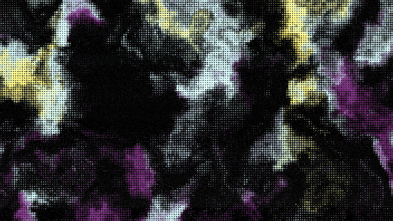

  

---

  
  
  
  
  

---

Wavey is an open-source RF sensing system that uses WiFi Channel State Information (CSI) to observe changes in physical environments without cameras, wearables, or active user participation.

It captures RF signal disturbances and converts them into spatial and motion information using low-cost ESP32-based sensing nodes and real-time signal processing.

---

## Features

- Device-free occupancy detection
- Motion and activity inference
- Real-time RF signal visualization
- Spatial occupancy estimation
- Multi-node mesh sensing
- Passive environmental monitoring
- RF fingerprinting and scene change detection
- Real-time CSI data collection and processing
- ESP32-CSI based sensing nodes
- Python-based analysis pipeline

---

  

---